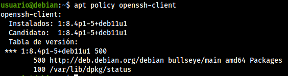
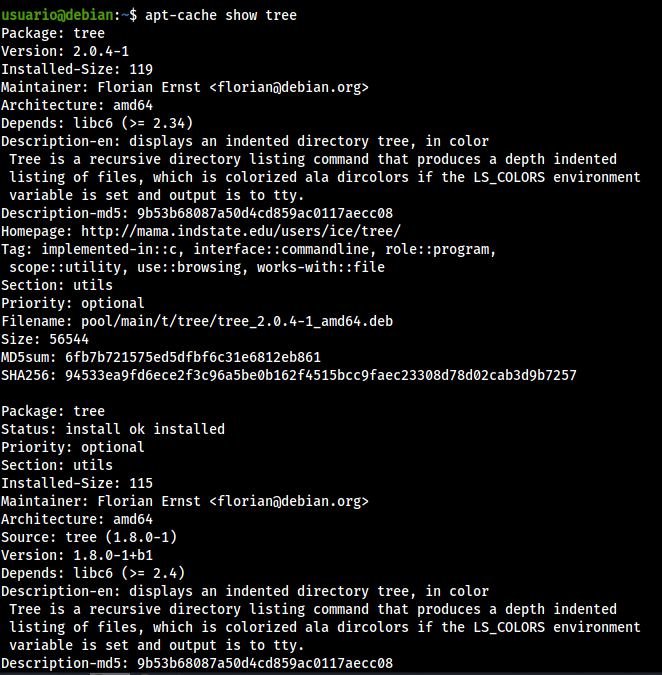
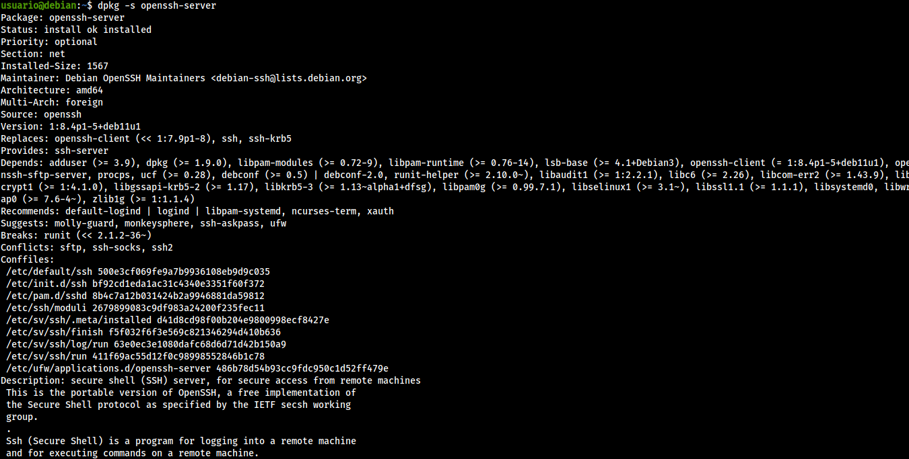
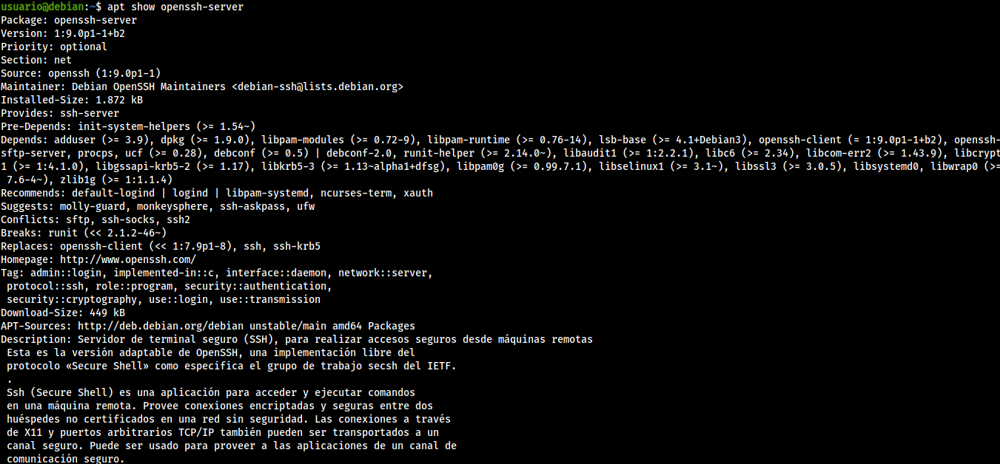
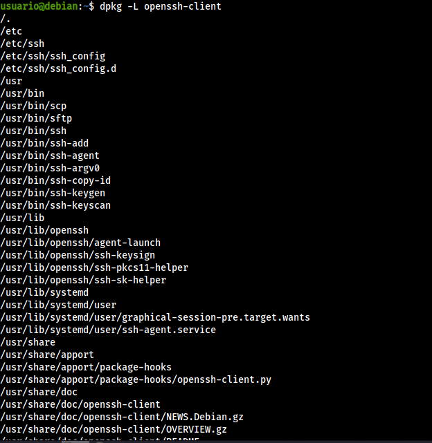
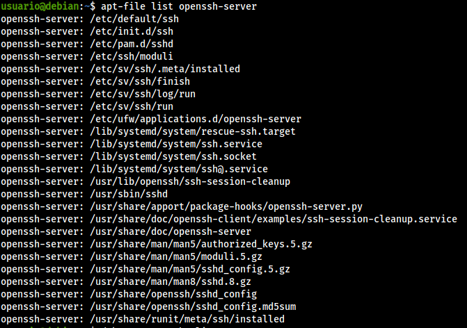
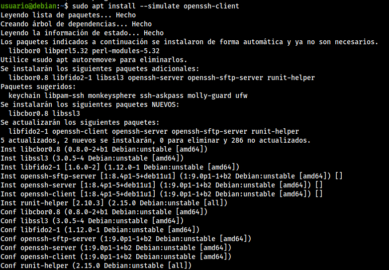

### Trabajo con apt, aptitude, dpkg

Prepara una máquina virtual con Debian bullseye, realizar las siguientes acciones:

1. **Que acciones consigo al realizar apt update y apt upgrade. Explica detalladamente.**
    * **update**: Se utiliza para descargar la información de todos los paquetes configurados en las fuentes.
    * **upgrade**: Instala las actualizaciones disponibles de los paquetes que están instalados actualmente en el sistema de las fuentes configuradas por `sources.list`
2. **Lista la relación de paquetes que pueden ser actualizados. ¿Qué información puedes sacar a tenor de lo mostrado en el listado?.**<br>
Se lista con `apt list --upgradable`. En la información que se muestra, podemos ver los paquetes que pueden ser actualizados, la última versión disponible, y la versión que tenemos actualizada actualmente.


3. **Indica la versión instalada, candidata así como la prioridad del paquete openssh-client.**<br>

```bash
apt policy openssh-client
```

<br>
4. **¿Cómo puedes sacar información de un paquete oficial instalado o que no este instalado?**<br>

```bash
apt-cache show
```


5. **Saca toda la información que puedas del paquete openssh-client que tienes actualmente instalado en tu máquina.**<br>

```bash
dpkg -s openssh-server
```


6. **Saca toda la información que puedas del paquete openssh-client candidato a actualizar en tu máquina.**<br>

```bash
apt show openssh-server
```


7. **Lista todo el contenido referente al paquete openssh-client actual de tu máquina. Utiliza para ello tanto dpkg como apt.**<br>
    * con dpkg usamos `dpkg -L openssh-client`

    * con apt usamos `apt-file list openssh-client`

8. **Listar el contenido de un paquete sin la necesidad de instalarlo o descargarlo.**<br>

```bash
apt-file list
```

9. **Simula la instalación del paquete openssh-client.**<br>

```bash
sudo apt install --simulate openssh-client
```


10. **¿Qué comando te informa de los posible bugs que presente un determinado paquete?**<br>

```bash
apt-listbugs -s
```

11. **Después de realizar un apt update && apt upgrade. Si quisieras actualizar únicamente los paquetes que tienen de cadena openssh. ¿Qué procedimiento seguirías?. Realiza esta acción, con las estructuras repetitivas que te ofrece bash, así como con el comando xargs.**
12. **¿Cómo encontrarías qué paquetes dependen de un paquete específico.**<br>

```bash
apt-cache rdepends
```

13. **¿Cómo procederías para encontrar el paquete al que pertenece un determinado fichero?**<br>

```bash
apt-file search paquete
```

14. **¿Que procedimientos emplearías para liberar la caché en cuanto a descargas de paquetería?**<br>

```bash
apt autoclean
```

15. **Realiza la instalación del paquete keyboard-configuration pasando previamente los valores de los parámetros de configuración como variables de entorno.**
16. **Reconfigura el paquete locales de tu equipo, añadiendo una localización que no exista previamente. Comprueba a modificar las variables de entorno correspondientes para que la sesión del usuario utilice otra localización.**
17. **Interrumpe la configuración de un paquete y explica los pasos a dar para continuar la instalación.**
18. **Explica la instrucción que utilizarías para hacer una actualización completa de todos los paquetes de tu sistema de manera completamente no interactiva**
19. **Bloquea la actualización de determinados paquetes.**<br>

```bash
apt mark hold paquete
```

## Trabajo con ficheros .deb

1. **Descarga un paquete sin instalarlo, es decir, descarga el fichero .deb correspondiente. Indica diferentes formas de hacerlo.**<br>
    * `apt download`
    * Entramos en la página [https://www.debian.org/distrib/packages](https://www.debian.org/distrib/packages), donde podemos encontrar los paquetes.
2. **¿Cómo puedes ver el contenido, que no extraerlo, de lo que se instalará en el sistema de un paquete deb?**

```bash
dpkg -c paquete.deb
```

3. **Sobre el fichero .deb descargado, utiliza el comando ar. ar permite extraer el contenido de una paquete deb. Indica el procedimiento para visualizar con ar el contenido del paquete deb. Con el paquete que has descargado y utilizando el comando ar, descomprime el paquete. ¿Qué información dispones después de la extracción?. Indica la finalidad de lo extraído.**<br>

```bash
ar -tvx paquete.deb
```

4. **Indica el procedimiento para descomprimir lo extraído por ar del punto anterior. ¿Qué información contiene?**

```bash
tar xvf archivo.tar.xz
```

## Trabajo con repositorios

1. Añade a tu fichero sources.list los repositorios de bullseye-backports y sid.
2. Configura el sistema APT para que los paquetes de debian bullseye tengan mayor prioridad y por tanto sean los que se instalen por defecto.
3. Configura el sistema APT para que los paquetes de bullseye-backports tengan mayor prioridad que los de unstable.
4. ¿Cómo añades la posibilidad de descargar paquetería de la arquitectura i386 en tu sistema. ¿Que comando has empleado?. Lista arquitecturas no nativas. ¿Cómo procederías para desechar la posibilidad de descargar paquetería de la arquitectura i386?
5. Si quisieras descargar un paquete, ¿cómo puedes saber todas las versiones disponible de dicho paquete?
6. Indica el procedimiento para descargar un paquete del repositorio stable.
7. Indica el procedimiento para descargar un paquete del repositorio de buster-backports.
8. Indica el procedimiento para descargar un paquete del repositorio de sid.
9. Indica el procedimiento para descargar un paquete de arquitectura i386.

## Trabajo con directorios

1. **Que cometidos tienen:**

* `/var/lib/apt/lists/`: Es el directorio que se utiliza para almacenar información de cada recurso de paquetes especificado en las fuentes del sistema.
* `/var/lib/dpkg/available`: Es un fichero que contiene la lista de los paquetes disponibles.
* `/var/lib/dpkg/status`: Es un fichero que contiene la base de datos local usada por **apt-cache** para obtener información rápido y sin acceder a internet.
* `/var/cache/apt/archives/`: Es el directorio en el que están almacenados los paquetes guardados en caché.


