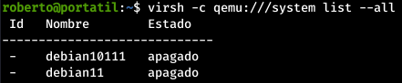

1. Una vez instalado el sistema de virtualización en tu equipo, entrega la salida del comando `virsh version`.

2. Ejecuta el comando list de virsh realizando una conexión privilegiada con tu usuario sin privilegios (no uses el root)<br>
El comando es el siguiente:

```bash
virsh -c qemu:///system list --all
```

3. Una vez creada la máquina en gnome-boxes responde y razona la siguiente pregunta: ¿Por qué al ejecutar `virsh -c qemu:///system list --all` no aparece la máquina creada por gnome-boxes?<br>
No aparece ya que la máquina se crea con el usuario sin privilegios.
4. Entrega la instrucción y la salida del comando virsh que muestra en el terminal la máquina creada en gnome-boxes.<br>
La instrucción es la siguiente:

```bash
virsh -c qemu:///session list
```
5. Entrega la instrucción y la salida del comando virsh haciendo una conexión remota a un equipo de un compañero. Explica los principales pasos para configurar tu equipo para que se puedan realizar conexiones remotas.<br>
En mi caso se lo hago a la compañera Nazareth y el comando es el siguiente:

```bash
virsh -c qemu+ssh://nazare@172.22.2.70/system list --all
```
Para que se puedan realizar conexiones remotas hay que configurar un servidor SSH en el ordenador al que queremos acceder, así como meter la clave pública del cliente en authorized_keys o conocer la contraseña del usuario.